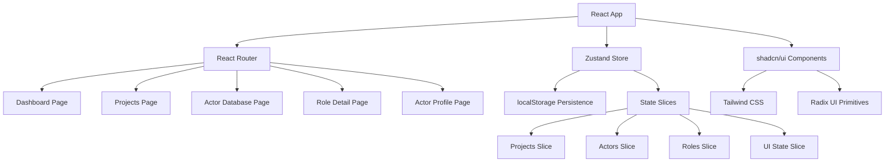

# Design Document

## Overview

The Casting Dashboard is a React-based single-page application that provides casting directors with a comprehensive tool for managing projects, actors, and the casting process. The application follows a modern frontend architecture using React 18+ with TypeScript, styled with Tailwind CSS and shadcn/ui components, and managed through Zustand for state management with localStorage persistence.

The system is designed as a frontend-only demo that simulates all backend interactions through local storage, providing a realistic casting management experience without requiring server infrastructure.

## Architecture

### High-Level Architecture



### Technology Stack

- **Framework**: React 18+ with TypeScript
- **Build Tool**: Vite for fast development and optimized builds
- **Routing**: React Router v6+ for client-side navigation
- **State Management**: Zustand with persist middleware for localStorage integration
- **Styling**: Tailwind CSS for utility-first styling
- **UI Components**: shadcn/ui built on Radix UI primitives for accessibility
- **Data Persistence**: localStorage for client-side data storage

### Folder Structure

```
src/
├── components/           # Reusable UI components
│   ├── ui/              # shadcn/ui components
│   ├── layout/          # Layout components (Navbar, Sidebar)
│   ├── actors/          # Actor-specific components
│   ├── projects/        # Project-specific components
│   └── common/          # Shared components
├── pages/               # Route components
│   ├── Dashboard.tsx
│   ├── Projects.tsx
│   ├── ActorDatabase.tsx
│   ├── RoleDetail.tsx
│   └── ActorProfile.tsx
├── store/               # Zustand store configuration
│   ├── index.ts         # Main store setup
│   ├── slices/          # Individual store slices
│   └── types.ts         # Store type definitions
├── types/               # TypeScript type definitions
├── utils/               # Utility functions
├── hooks/               # Custom React hooks
└── mockData/            # Initial seed data
```

## Components and Interfaces

### Core Data Models

```typescript
interface Actor {
  id: string;
  name: string;
  age: number;
  gender: string;
  race: string;
  height: string;
  representation: string;
  tags: string[];
  notes: string;
  headshotUrl?: string;
  resumeUrl?: string;
  createdAt: Date;
  updatedAt: Date;
}

interface Project {
  id: string;
  name: string;
  description?: string;
  parentId?: string; // For nested folder structure
  type: 'folder' | 'project';
  createdAt: Date;
  updatedAt: Date;
}

interface Role {
  id: string;
  name: string;
  description?: string;
  requirements?: string;
  projectId: string; // References Project.id
  customBuckets: StatusBucket[];
  createdAt: Date;
  updatedAt: Date;
}

interface StatusBucket {
  id: string;
  name: string;
  color: string;
  order: number;
}

interface ActorAssignment {
  id: string;
  actorId: string;
  roleId: string;
  bucketId: string;
  notes?: string;
  assignedAt: Date;
  updatedAt: Date;
}
```

### Store Architecture

The Zustand store is organized into slices for better maintainability:

```typescript
interface AppStore {
  // Projects slice
  projects: Project[];
  addProject: (project: Omit<Project, 'id' | 'createdAt' | 'updatedAt'>) => void;
  updateProject: (id: string, updates: Partial<Project>) => void;
  deleteProject: (id: string) => void;
  getProjectHierarchy: () => Project[];
  
  // Actors slice
  actors: Actor[];
  addActor: (actor: Omit<Actor, 'id' | 'createdAt' | 'updatedAt'>) => void;
  updateActor: (id: string, updates: Partial<Actor>) => void;
  deleteActor: (id: string) => void;
  searchActors: (filters: ActorFilters) => Actor[];
  
  // Roles slice
  roles: Role[];
  addRole: (role: Omit<Role, 'id' | 'createdAt' | 'updatedAt'>) => void;
  updateRole: (id: string, updates: Partial<Role>) => void;
  deleteRole: (id: string) => void;
  getRolesByProject: (projectId: string) => Role[];
  
  // Assignments slice
  assignments: ActorAssignment[];
  assignActorToRole: (assignment: Omit<ActorAssignment, 'id' | 'assignedAt' | 'updatedAt'>) => void;
  updateAssignment: (id: string, updates: Partial<ActorAssignment>) => void;
  removeAssignment: (id: string) => void;
  getAssignmentsByRole: (roleId: string) => ActorAssignment[];
  
  // UI state
  sidebarCollapsed: boolean;
  toggleSidebar: () => void;
  currentView: 'grid' | 'table';
  setCurrentView: (view: 'grid' | 'table') => void;
}
```

### Key Components

#### Layout Components

**AppLayout**: Main application shell with navbar, sidebar, and content area
- Responsive design with collapsible sidebar
- Navigation state management
- User profile dropdown

**Navbar**: Top navigation bar
- Application branding
- User profile menu
- Global search (future enhancement)

**Sidebar**: Left navigation panel
- Main navigation links (Dashboard, Projects, Actor Database)
- Collapsible design for mobile
- Active route highlighting

#### Project Components

**ProjectHierarchy**: Tree-like folder navigation
- Drag-and-drop support for reorganization
- Breadcrumb navigation
- Context menus for folder/role actions

**FolderView**: Display contents of a selected folder
- Grid/list toggle for roles
- Add folder/role buttons
- Sorting and filtering options

#### Actor Components

**ActorGrid**: Grid view of actors with cards
- Responsive grid layout
- Actor thumbnail and basic info
- Quick action buttons

**ActorTable**: Table view of actors
- Sortable columns
- Inline editing capabilities
- Bulk selection actions

**ActorFilters**: Sidebar filtering component
- Multi-select filters for attributes
- Search functionality
- Clear filters option

**ActorModal**: Detailed actor information modal
- Full actor profile display
- Inline editing capabilities
- Role assignment history

#### Role Components

**RoleDetail**: Main role management interface
- Actor assignment buckets
- Drag-and-drop between buckets
- Bucket customization tools

**StatusBuckets**: Customizable workflow buckets
- Add/edit/delete buckets
- Color coding
- Reorder functionality

## Data Models

### Hierarchical Project Structure

Projects support unlimited nesting through a parent-child relationship:

```typescript
// Example hierarchy
const projects = [
  { id: '1', name: 'Equalizer', type: 'folder', parentId: null },
  { id: '2', name: 'Season 2', type: 'folder', parentId: '1' },
  { id: '3', name: 'Episode 5', type: 'project', parentId: '2' },
  { id: '4', name: 'Hamilton', type: 'folder', parentId: null },
  { id: '5', name: 'NY Version', type: 'project', parentId: '4' }
];
```

### Actor Data Management

Actors maintain comprehensive profiles with flexible tagging:

```typescript
const actorExample = {
  id: 'actor-1',
  name: 'John Smith',
  age: 28,
  gender: 'Male',
  race: 'Caucasian',
  height: '6\'0"',
  representation: 'CAA',
  tags: ['Leading Man', 'Action', 'Drama'],
  notes: 'Strong stage presence, excellent with accents',
  headshotUrl: '/uploads/headshots/john-smith.jpg',
  resumeUrl: '/uploads/resumes/john-smith.pdf'
};
```

### Role Assignment System

The assignment system tracks actors through customizable workflow stages:

```typescript
const roleExample = {
  id: 'role-1',
  name: 'Detective Martinez',
  description: 'Lead detective character',
  projectId: 'project-1',
  customBuckets: [
    { id: 'bucket-1', name: 'Submitted', color: 'gray', order: 1 },
    { id: 'bucket-2', name: 'Callback', color: 'yellow', order: 2 },
    { id: 'bucket-3', name: 'Booked', color: 'green', order: 3 }
  ]
};
```

## Error Handling

### Client-Side Error Boundaries

Implement React Error Boundaries at key levels:
- App-level boundary for catastrophic errors
- Page-level boundaries for route-specific errors
- Component-level boundaries for complex components

### Data Validation

Input validation using TypeScript and runtime checks:
- Form validation with react-hook-form
- Data sanitization before localStorage storage

### localStorage Error Handling

Graceful handling of storage limitations:
- Quota exceeded errors
- Storage unavailable scenarios
- Data corruption recovery

```typescript
const handleStorageError = (error: Error) => {
  if (error.name === 'QuotaExceededError') {
    // Handle storage quota exceeded
    showNotification('Storage limit reached. Please clear some data.');
  } else if (error.name === 'SecurityError') {
    // Handle private browsing mode
    showNotification('Data persistence unavailable in private mode.');
  }
};
```

## Testing Strategy

### Unit Testing

- **Components**: Test rendering, props handling, and user interactions
- **Store**: Test state mutations and side effects
- **Utilities**: Test helper functions and data transformations
- **Hooks**: Test custom hook behavior and state management

### Integration Testing

- **User Flows**: Test complete user journeys (add actor → assign to role → move through buckets)
- **Data Persistence**: Test localStorage integration and data recovery
- **Navigation**: Test routing and state preservation across pages

### Testing Tools

- **Jest**: Unit test runner
- **React Testing Library**: Component testing utilities
- **MSW**: Mock service worker for API simulation (future backend integration)
- **Playwright**: End-to-end testing for critical user flows

### Test Structure

```typescript
// Example component test
describe('ActorGrid', () => {
  it('displays actors in grid format', () => {
    render(<ActorGrid actors={mockActors} />);
    expect(screen.getAllByTestId('actor-card')).toHaveLength(mockActors.length);
  });

  it('handles actor selection', () => {
    const onSelect = jest.fn();
    render(<ActorGrid actors={mockActors} onActorSelect={onSelect} />);
    fireEvent.click(screen.getByText('John Smith'));
    expect(onSelect).toHaveBeenCalledWith(mockActors[0]);
  });
});
```

### Performance Considerations

- **Virtual Scrolling**: For large actor lists (react-window)
- **Memoization**: Prevent unnecessary re-renders with React.memo and useMemo
- **Lazy Loading**: Code splitting for route components
- **Debounced Search**: Optimize search performance
- **Optimistic Updates**: Immediate UI feedback for user actions

This design provides a solid foundation for building a comprehensive casting dashboard that meets all the specified requirements while maintaining good performance, accessibility, and user experience standards.